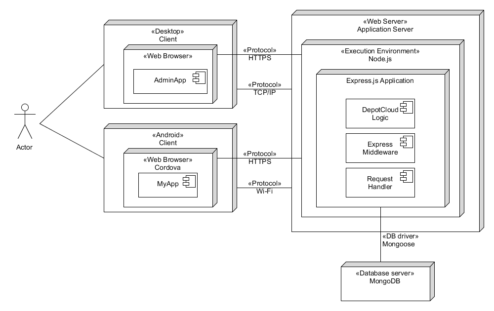

# Definición de la arquitectura del sistema
## Propósito del documento
* Proporcionar un entendimiento común de las arquitecturas técnicas que van a ser usadas durante el desarrollo y despliegue de la solución incluyendo:
  * Hardware/Infraestructure
  * Arquitectura de Software
* Describir en entorno de despliegue de la solución y (si es diferente) el entorno de desarrollo.
* Proporcionar una descripción general de la evolución prevista de áreas de:
  * Hardware (infraestructura, almacenamiento, etc.)
  * Software (componentes, interacciones principales, etc.)
  * Seguridad (polticas de acceso, control de acceso, etc.)
## Arquitectura del sistema
### Vista general
**Diagrama de despliegue**

**Diagrama de Componentes y Conectores**

### Componentes de hardware y sus relaciones
**Catálogo de la vista**  
Siguiendo un orden de flujo de interacción se encuentran los siguientes componentes:
* El cliente, componiéndose de un dispositivo móvil que puede ser iOS y Android. Incluye el navegador web Cordova para conseguir un funcionamiento híbrido, el cual además es el encargado de generar las peticiones HTTP e interpretar la aplicación cliente y las respuestas del servidor.
* El servidor web, componiéndose del entorno de ejecución Node.js/Apache Tomcat en el cual se despliega Spring/Express, una aplicación framework que actúa como middleware, conteniendo a su vez la lógica de la aplicación. La conexión del equipo se realiza en la capa de transporte con la máquina que aloja el servidor vía TCP/IP y en la capa de aplicación entre el navegador y el servidor vía HTTP.
* El servidor de base de datos, el cual se conecta con la aplicación del servidor mediante un DB Driver, en este caso Mongoose/JDBC.

**Exposición de razones**  

### Componentes de software y sus relaciones
**Catálogo de la visata**  
* El componente DepotCloudApp se corresponde al cliente web para móvil de la aplicación. Todas las conexiones que se realizan con los Services se hacen vía API REST salvo con el componente NotificationsService que se comunica mediante WebSockets para actualizarlo en tiempo real.

Cada uno de los componentes Services se corresponden a la API pública de interfaces REST conteniendo los conjuntos de funcionalidades correspondientes a cada uno de ellos. Todos los componentes Services que se comunican con los Repository lo hacen mediante Mongoose/jdbc.

Por otro lado se encuentran los Repository correspondientes para acceder a la base de datos MongoDB/MySQL.

**Exposición de razones**

### Requisitos no funcionales
Describe qué requisitos no funcionales son importantes para el proyecto y cómo la arquitectura descrita les da soporte. 
Su importancia de cara al proyecto puede graduarse de forma parecida al alcance del documento de términos de referencia 
(debe, debería, podrá, queda fuera por ahora).

| Requisito no funcional | Prioridad | Cómo es apoyado por la arquitectura |
| ---------------------- | --------- | ----------- |
| Usabilidad | Alta | El sistema debe someterse a la técnica KLM, y algunas métricas probadas con posibles usuarios finales. Los tiempos analizados resultantes con KLM de las actividades principales deberían ser inferiores a 2 minutos. Podría tener una forma rápida para traducir la aplicación. Quedan fuera por ahora aspectos de accesibilidad.
| Rendimiento | Media | Cualquier tiempo de respuesta de la aplición no debería tener tiempos de respuesta altos. Esto se quiere conseguir gracias a la implementación de una arquitectura RESTful.
| Capacidad | Media | Se va a trabajar con imágenes Full HD como máximo, siendo estos los datos más pesados en la transmisión. Al menos 3 personas deben poder acceder concurrentemente a la aplicación.
| Escalabilidad | Alta | El sistema debe plantear una arquitectura que sea mínimamente escabale, así como dejar descrita una documentación de qué debería de hacerse en el futuro para conseguirlo. Podría hacerse uso de herramientas como Apache Jmeter para analizar la carga del sistema.
| Seguridad | Media | La aplicación va hacer uso de tráfico cifrado mediante https. Debe cifrar al menos las contraseñas en la base de datos. Se deben documentar aspectos pensados con la protección contra sistemas de SPAM y de BOTs, aunque la implementación queda fuera del alcance.
| Disponibilidad | Media | Se va a seguir una metología de integración continua para intentar garantizar que todos los despliegues del sistema se hagan de forma automática y reducir el tiempo que pueda pasar al sistema desconectado debido a fallos o falta de despliegue automático.
| Resilencia | Baja | Se van a dejar documentados aspectos referentes pero no se van a llevar a cabo en la implementación del sistema.
| Recuperación | Baja | Se van a dejar documentados aspectos referentes pero no se van a llevar a cabo en la implementación del sistema.
### Mantenibilidad
Se busca un sistema que al menos tenga una vida útil de más de 2 años.  

Con eso en mente, se ha de pensar en un sistema claramente modularizado y organizado, con una buena documentación y un código legible. Para ello, el sistema podría contar con una serie de estándares y definiciones de hecho, así como el uso de algunas herramientas de *Quality Assurance* como SonarQube.
 
Por otro lado, para conseguir una buena documentación de la API de forma mantenible, el sistema podría hacer uso de la herramienta *swagger*.

## Entornos técnicos
### Plataforma de desarrollo
Hay que identificar todas las herramientas de software que se van a utilizar durante el desarrollo. Esta lista es extensa ya que hay
que incluir compiladores, entornos de desarrollo, sistemas de gestión de configuraciones, herramientas de pruebas, etc.
### Plataforma de destino
Hay que identificar todo el hardware necesario así como todas las herramientas necesarias para su administración y mantenimiento.
